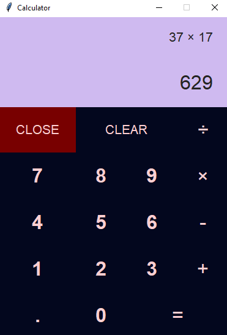

# Calculator
A simple calculator made with Tkinter in python.
### Tkinter
Tkinter is the standard Python interface to the Tk GUI toolkit. It allows you to create graphical user interfaces (GUIs) for your Python applications.
### Requirements
- Python3
### How to open
- Git clone the project to your computer using `git clone https://github.com/harsh-varun/Calculator.git`
- Open cmd
- cd to the file
- run `python calculator.py`
### Preview

